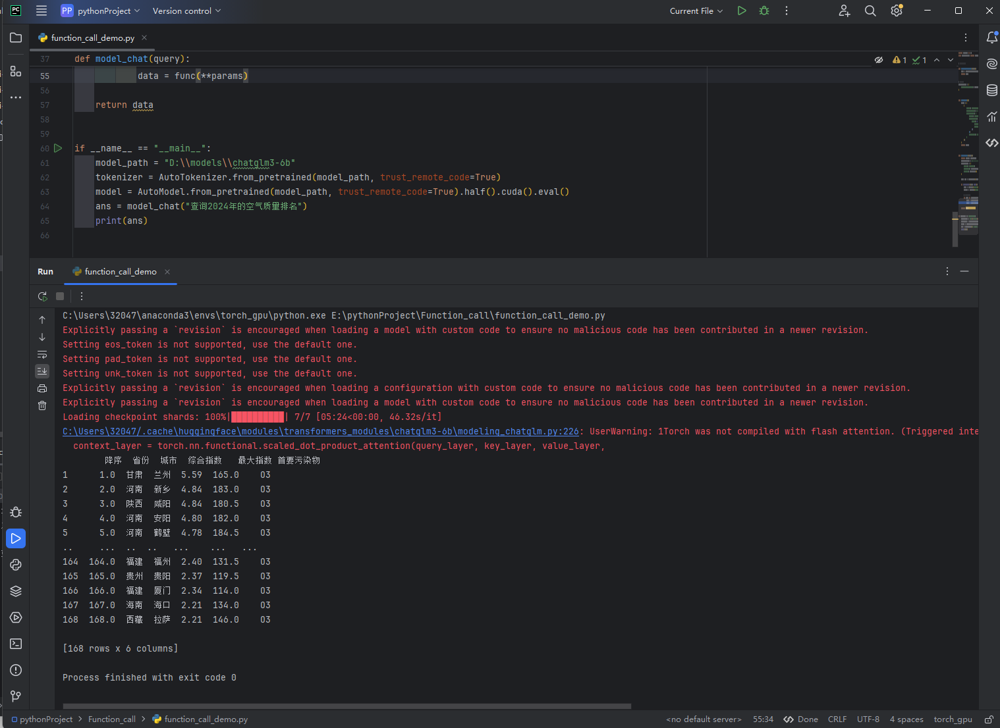
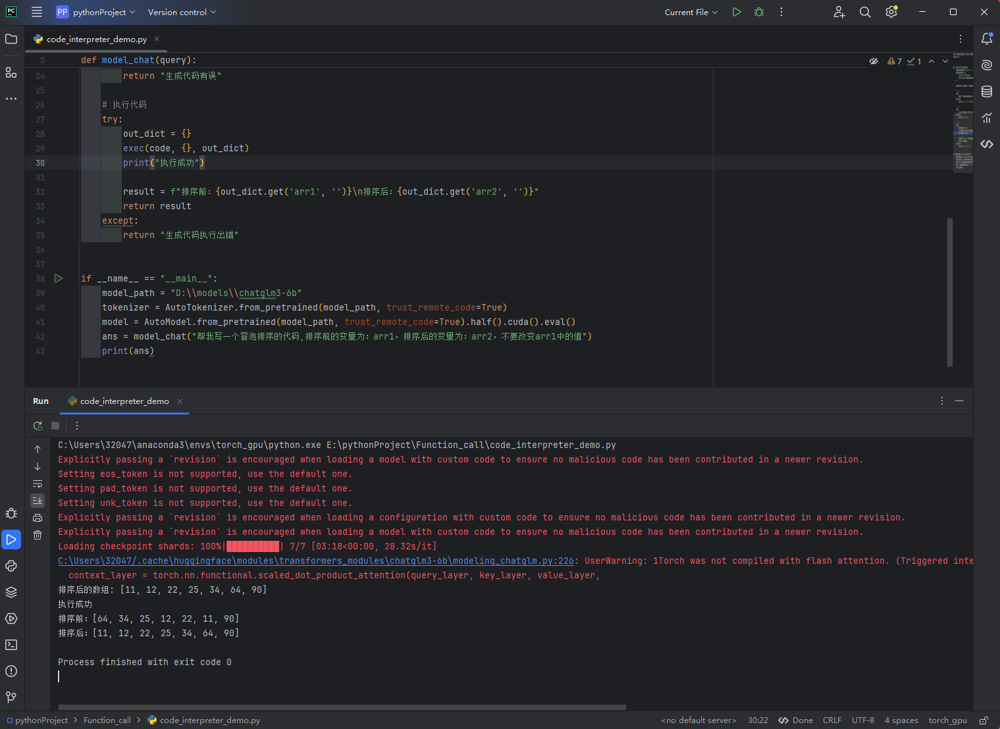

# Function Call
在大模型中，function call（函数调用）通常指的是模型具备的一种能力，即能够调用外部的函数或工具来完成特定的任务，从而增强模型的功能和解决问题的能力。

工作原理：
- 当用户向大模型提出一个请求时，模型会先理解这个请求的意图。例如，用户可能询问某个城市的天气情况。大模型会分析这个请求是关于天气查询的。
- 然后，模型会判断是否需要调用外部的函数来获取准确的信息。在天气查询的例子中，它会查找与天气相关的函数，这个函数可能是接入了气象数据源的接口。
- 模型会按照函数的要求准备好参数，比如城市名称等关键信息。接着，通过某种通信协议或接口规范，将这些参数传递给外部的天气查询函数。
- 外部函数接收到参数后，会执行相应的操作，如从气象数据库中获取该城市的天气数据，然后将结果返回给大模型。大模型再将这个结果以合适的方式呈现给用户，如直接告诉用户温度、降水概率等具体天气信息。

# Code Interpreter
大模型中的 Code Interpreter 是一种特殊的工具或功能，它赋予了语言模型运行代码的能力，使得模型能够根据用户的自然语言指令生成并执行代码，从而逐步解决复杂的问题。

工作原理：
- 当用户向大模型提出一个需要复杂计算或操作的任务时，模型会先理解任务需求，并将其转化为相应的代码。
- 然后，Code Interpreter 会将生成的代码置于一个安全的沙盒环境中执行。
- 代码执行后，Code Interpreter 会将执行的结果返回给大模型，模型再根据结果进行进一步的分析、解释和响应，以最终完成用户的任务。

# 安装依赖
在运行这些脚本前，请确保安装以下依赖：
```
pip install transformers akshare torch
```

# Function Call和Code Interpreter功能Demo

chatglm3-6b文件下载：https://www.modelscope.cn/models/ZhipuAI/chatglm3-6b/files

Function Call demo执行：


Code Interpreter demo执行：

